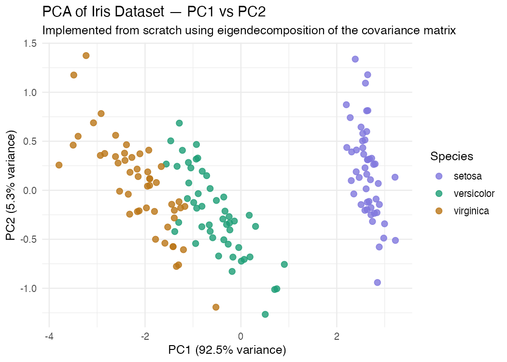

# Linear Algebra from Scratch in R

A self-directed study project implementing core linear algebra algorithms from first principles in R, built as preparation for graduate study in data science. Algorithms are implemented without relying on R's built-in matrix operators or statistical functions, then validated against them.

 
---

## What is this project?

Rather than calling `%*%`, `solve()`, `eigen()`, or `prcomp()`, this repository rebuilds each operation from the mathematical definition — using loops, dot products, and cofactor expansion — then validates the
result against R's optimised implementations. The goal is to demonstrate that the mathematics is understood, not just the syntax.

The project culminates in applying the PCA pipeline to a real neuroscience dataset from the Allen Brain Observatory, connecting the linear algebraic foundations to a domain where dimensionality reduction has direct biologica meaning.

---

## What did I build?

### Mathematical foundations

**Matrix operations** (`R/matrix_ops.R`)
Custom implementations of dot products, matrix multiplication, transpose, vector norms, determinants (2×2 and 3×3 via cofactor expansion), and matrix inverse — all without R's `%*%`, `det()`, or `solve()`.

**Linear systems solver** (`R/linear_systems.R`)
A full Gaussian elimination pipeline: forward elimination with partial pivoting (`row_reduce()`), back substitution (`back_substitute()`), and a
combined solver (`solve_gauss()`) that detects singular and near-singular matrices before they cause numerical errors.

**Eigendecomposition** (`R/eigen.R`)
Power iteration to find the dominant eigenvector, deflation to find subsequent eigenvectors, and a full eigendecomposition (`eigen_decomp()`) that chains both. Implemented for symmetric matrices, covering the case required by PCA.

**Principal Component Analysis** (`R/pca.R`)
PCA built entirely on top of `eigen.R`: centring, covariance matrix construction, eigendecomposition, projection, and explained variance computation (`compute_pca()`). Validated against `prcomp()`.

**SVD** (`R/svd_compress.R`)
Singular value decomposition derived from eigendecomposition of AᵀA (`compute_svd()`).

---

## Key results

### Linear systems

`solve_gauss()` recovers **x = (2, 3, −1)** from a 3×3 system with residual ‖Ax − b‖ < 1e-10, matching `solve()` to 10 decimal places. The solver correctly detects singular matrices and throws an informative
error rather than returning numerically corrupted results.

### PCA — iris dataset

```
PC1 eigenvalue:   4.2282    prcomp SD²: 4.2282  ✓
PC2 eigenvalue:   0.2427    prcomp SD²: 0.2427  ✓

PC1 variance explained:  92.46%
PC1 + PC2 combined:      97.77%
```

Two principal components capture **97.77%** of variance in the four-dimensional iris dataset, cleanly separating the three species with no class labels used during analysis. The implementation matches `prcomp()` to 4 decimal places.

### PCA — Allen Brain Observatory

PCA applied to functional characterisations of 316 mouse visual cortex neurons (47 properties per neuron, scaled to unit variance):

```
PC1 variance explained:   6.7%
PC1 + PC2 combined:      13.0%
Components for 80%:      25 of 47
Components for 95%:      38 of 47
```

PC1 captured a **direction selectivity and laminar position** axis(loading = 0.857 on `dsi_dg`, with  co-variation across cortical depth), consistent with known laminar organisation in mouse visual cortex. PC2
captured a **receptive field eccentricity and reliability** axis (loading = 0.468 on `rf_distance_lsn`). The high dimensionality — 25 components needed for 80% of variance — reflects the genuine functional diversity of visual cortex neurons, not a limitation of the method.

The contrast with iris (97.77% in 2 components vs 13.0% in 2 components) illustrates a core property of PCA: it reveals the true dimensionality of whatever data it is given, rather than imposing a low-dimensional structure.

---

## Repository structure

| Path | Contents |
|------|----------|
| `R/matrix_ops.R` | Dot products, matrix multiply, transpose, norms, determinants, inverse |
| `R/linear_systems.R` | Gaussian elimination, back substitution, singular detection |
| `R/eigen.R` | Power iteration, deflation, eigendecomposition |
| `R/pca.R` | Centring, covariance matrix, PCA, validation against prcomp |
| `R/svd_compress.R` | SVD via eigendecomposition |
| `R/neural_pca.R` | Neural data loading and preparation utilities |
| `vignettes/` | Mathematical write-ups with derivations and worked examples |
| `tests/` | testthat suite — all tests passing |
| `data/` | Sample datasets with source citations and README|  
| `figures/` | Output plots embedded in vignettes and README |
| `plots/` | One-off scripts to regenerate figures |

---

## Vignettes

The mathematics behind each implementation is documented in step-by-step vignettes. Each one opens with geometric motivation, derives the key result, implements it in R, and validates the output.

| Vignette | Topic |
|----------|-------|
| [01: Vectors, Matrices, and Linear Transformations](vignettes/01_matrices.html) | Dot products, matrix multiply, transpose, determinants, inverse |
| [02: Solving Linear Systems with Gaussian Elimination](vignettes/02_linear_systems.html) | Augmented matrix, row operations, forward elimination, back substitution, partial pivoting |
| [03: Principal Component Analysis from First Principles](vignettes/03_pca.html) | Lagrange multiplier derivation, covariance matrix, diagonalisation, iris dataset |
| [04: SVD and its Relationship to PCA](vignettes/04_svd_bridge.html) | SVD from eigendecomposition of AᵀA, equivalence to PCA |
| [05: PCA on Neural Population Data](vignettes/05_neural_pca.html) | Allen Brain Observatory, scaling, high-dimensional results, biological interpretation |

---

## Running the tests 

```r
# install dependencies
install.packages(c("devtools", "testthat", "ggplot2"))

# run the full test suite
devtools::test()
```

The test suite covers edge cases including zero pivots, mismatched dimensions, singular systems, identity matrix behaviour, eigenvector orthogonality, and the Av = λv residual condition. All tests pass.

---

## Data sources

- **Iris dataset**: Fisher, R.A. (1936). Built into R as `datasets::iris`.
- **Allen Brain Observatory**: Copyright 2016 Allen Institute for Brain
  Science. Allen Brain Observatory. Available at:
  portal.brain-map.org/explore/circuits/visual-coding-neuropixels.
  Data accessed under the Allen Institute Terms of Use.

---

## Dependencies

```r
install.packages(c(
  "devtools",    # package development and testing
  "testthat",    # unit testing
  "knitr",       # vignette rendering
  "rmarkdown",   # R Markdown support
  "ggplot2",     # visualisation
  "R.matlab"     # optional: loading .mat files
))
```

R version 4.3.0 or later recommended.
